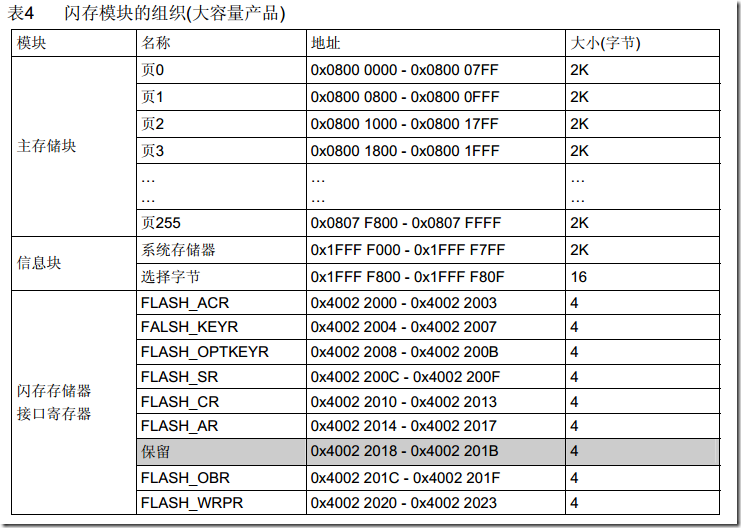
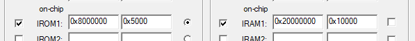
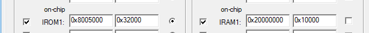
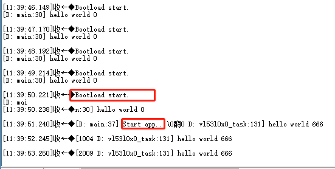

# STM32F103 Bootloader规划

采用bootload和app分开的模式这样可以后续远程升级程序。

## 分配bootloader和app的空间

它的flash的大小是512k,所以把它按下面分配，因为我们没有SD卡所以通过串口的程序需要放到第二区域，校验无误后才能放到第一个区域。

stm32f103zet6的flash如下：

0x08000000 ---0x0800 4FFF分配给bootloader使用，大小是20k（验证过bootload 程序大概是12KB）
0x0800 5000----0x0803 6FFF 分配给APP1的使用，大小是200k = 0x32000
0x0803 7000----0x0806 8FFF 分配给APP2下载仓库使用，大小是200k
0x0806 9000 ----0x0807 FFFF 分配给user_flag和其它标志使用，大小是92k

bootload地址规划如下：

app 地址如下：

## 下载串口协议

1. 启动串口传输 先发送指令给下位机，让其复位。

2. 接收到下位机bootload启动后的指令发送(42 6F 6F 74 6C 6F 61 64 20 73 74 61 72 74 2E 0D 0A, 也就是"Bootload start.\r\n") , 指令进入下载模式 (发送31 0D 0A， “1\r\n”);
3. 开始发送数据，分包发送。如果下位机不响应需要重发该包
4. 发送完成后发送结速指令，复位下位机

通过USART1 波特率115200 串口获取数据，采用分包发送的模式给下位机发送数据，每个包需要带crc. 相邻两个包的发送间隔为n ms.

得到单个数据校验无误后放入flash, 并验证单包CRC，与总CRC.

## 数据校验

每个包要加入8位chksum，总包位加入CRC32校验，CRC32多项式为：0x04C11DB7

## 程序存储过程

1. flash 需要整个扇区写入

## 	Bootload 跳转到app

## 参考文档

[STM32F10x 学习笔记3（CRC计算单元）](https://blog.csdn.net/liyuanbhu/article/details/8746044)

