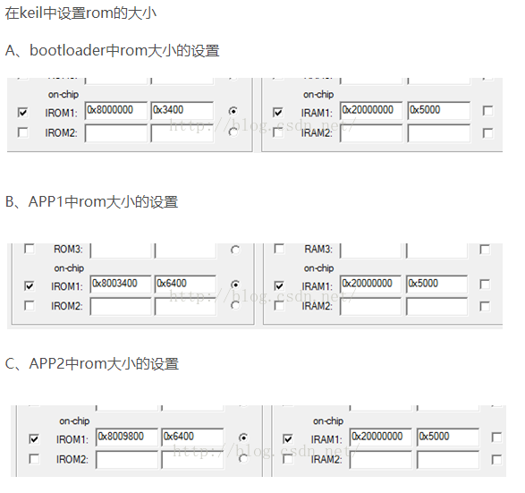

# STM32F103 Bootloader规划

采用bootload和app分开的模式这样可以后续远程升级程序。

## 分配bootloader和app的空间

它的flash的大小是64k,所以把它按下面分配，因为我们没有SD卡所以通过串口的程序需要放到第二区域，校验无误后才能放到第一个区域
0x08000000 ---0x0800 33FF分配给bootloader使用，大小是13k
0x0800 3400----0x080097FF分配给APP1的使用，大小是25k
0x08009800----0x0800 FBFF分配给APP2下载仓库使用，大小是25k
0x0800FC00----0x0800 FFFF 分配给user_flag和其它标志使用，大小是1k

## 下载串口协议

1. 启动串口传输 先发送指令给下位机，让其复位。

2. 接收到下位机bootload启动后的指令发送 指令进入下载模式
3. 开始发送数据，分包发送。如果下位机不响应需要重发该包
4. 发送完成后发送结速指令，复位下位机

通过USART1 波特率115200 串口获取数据，采用分包发送的模式给下位机发送数据，每个包需要带crc. 相邻两个包的发送间隔为n ms.

得到单个数据校验无误后放入flash, 并验证单包CRC，与总CRC.